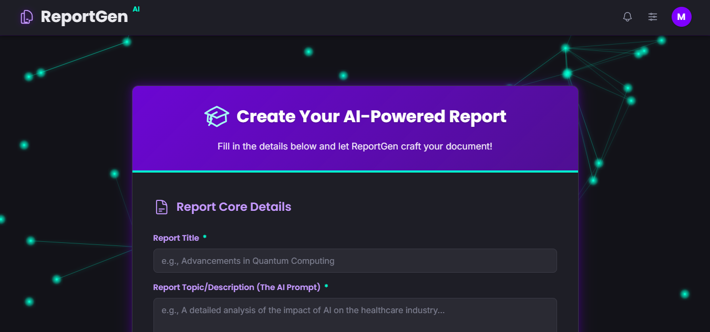
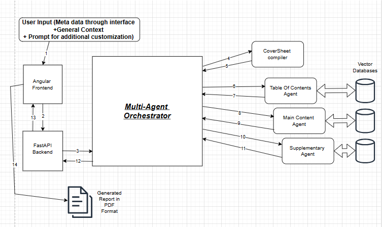

# ReportGen AI: An AI-Powered LaTeX Report Generator



ReportGen AI is a full-stack web application that leverages a multi-agent backend system to automatically generate professional, publication-quality reports in PDF format from a simple user prompt. It combines the power of Google's Gemini LLM, Retrieval-Augmented Generation (RAG) with ChromaDB, and a robust LaTeX compilation pipeline.

### System Workflow



### Key Features

*   **Multi-Agent System:** The backend orchestrates specialized Python agents for each stage of report creation: Table of Contents, Cover Page, Main Content, Bibliography, and Appendices.
*   **RAG-Powered Content:** Integrates with a local vector store to provide contextually relevant and accurate information, grounding the LLM's output.
*   **Dynamic LaTeX Generation:** Generates clean, modular `.tex` files on the fly and compiles them into a final PDF using a local MiKTeX distribution.
*   **Customizable Output:** Users can specify report titles, authors, mentors, and even upload a university/company logo and a primary color for a personalized theme.
*   **Modern Frontend:** A sleek, responsive user interface built with the latest standalone components in Angular.

---

### Technology Stack

| Area      | Technology                                                                                                                                                                                               |
| --------- | -------------------------------------------------------------------------------------------------------------------------------------------------------------------------------------------------------- |
| **Frontend**  |    |
| **Backend**   |                                                                                                                    |
| **AI Engine** |             |
| **Compilation** |  (via MiKTeX)                                                                                                                |

---

### Getting Started

Follow these instructions to get a local copy up and running for development and testing purposes.

#### Prerequisites
*   Python 3.10+
*   Node.js and npm
*   Angular v17.3.17
*   A local LaTeX distribution (e.g., [MiKTeX](https://miktex.org/download) for Windows, MacTeX for macOS, TeX Live for Linux).
    *   **Important:** Ensure the `pdflatex` command is available in your system's PATH.

#### Backend Setup

1.  **Clone the repository:**
    ```bash
    git clone https://github.com/Ragoubi57/ReportGen.git
    cd ReportGen/backend
    ```

2.  **Create and activate a virtual environment:**
    ```bash
    # For Windows
    python -m venv venv
    .\venv\Scripts\activate

    # For macOS/Linux
    python3 -m venv venv
    source venv/bin/activate
    ```

3.  **Install Python dependencies:**
    ```bash
    pip install -r requirements.txt
    ```

4.  **Set up your API Key:**
    *   Create a file named `.env` in the `backend/` directory.
    *   Add your Google Gemini API key to it:
        ```
        GEMINI_API_KEY="your_secret_api_key"
        ```

5.  **Create the Vector Store:**
    *   Add your source documents (e.g., `.txt` or `.pdf` files) to the `backend/data` directory.
    *   Run the ingestion script to create the local embeddings:
        ```bash
        python src/ingest_data.py 
        ```
    *   *(Note: The ingestion script is a placeholder; you should provide the one you used to generate your `embeddings` folder).*

6.  **Run the FastAPI server:**
    ```bash
    uvicorn main_api:app --host 0.0.0.0 --port 5000 --reload
    ```
    The backend API will be running at `http://localhost:5000`.

#### Frontend Setup

1.  **Navigate to the frontend directory:**
    ```bash
    # From the root directory
    cd frontend
    ```

2.  **Install npm packages:**
    ```bash
    npm install
    ```

3.  **Run the Angular development server:**
    ```bash
    ng serve
    ```
    The frontend will be available at `http://localhost:4200`.

---

### Project Structure

```
.
├── backend/
│   ├── src/
│   |   ├── embeddings/       # My own Generated vector embeddings(you can use your own data and make a chromadb vector database yourself)
│   │   ├── cover.py          # Agent for cover page
│   │   ├── generator.py      # Wrapper for Gemini API calls
│   │   ├── latex_utils.py    # Centralized text processing & escaping
│   │   ├── main_content.py   # Agent for report body
│   │   ├── orchestrator.py   # Main controller for the agent workflow
│   │   ├── retriever.py      # RAG logic
│   │   ├── supplementary.py  # Agent for bibliography & appendices
│   │   └── toc.py            # Agent for table of contents
│   ├── main_api.py           # FastAPI application entry point
│   └── requirements.txt
├── frontend/
│   ├── src/
│   │   └── ...
│   ├── angular.json
│   └── package.json
└── README.md
---
```

### Important Remarks:
* This project was pushed with my own vector embeddings that i made with a certain dataset of mine. You have to use your own dataset and make your own embeddings with chromadb in order to use RAG efficiently. Although , the project works fine without RAG if you want that option.
* The loading spinner component in the frontend is still static and not synced with the backend although it doesn't affect the project's
performance by any means.
* The figures feature in the report is still being implemented in progress. As for now there is only the possibility to upload one single figure that is always put before the first section of the report regardless but i will make the feature better and more robust in the  future.
* I've tried to make the latex overall compilation to be as robust as possible. But when running this project with different prompts you may run into different kinds of errors in compilation.


